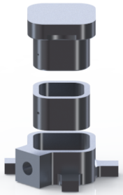

# Baseplate Components for the UCLA Miniscope v4

This repository contains design file for baseplates and related components for the
[UCLA Miniscope v4](https://github.com/Aharoni-Lab/Miniscope-v4) which are based on and are compatible to the
original designs provided by the Miniscope project but have been re-drawn.

Modifications include small adjustments to make the parts easier to manufacture, as well as using an M1.6 cone point or flat end
set screw that is easier to obtain and does not have to be specially made.

In addition to the updated baseplate this repository also contains design files for a lid to protect the GRIN lens while the
Miniscope is not attached.

All design files are based on the original [baseplate variant 2](https://github.com/Aharoni-Lab/Miniscope-v4/wiki/Parts-List#v4-base-plate)
designs and assume your Miniscope has an objective module sleeve.

These files have been designed in collaboration with the mechanics workshop at Heidelberg University, Germany and are licensed
under the CERN Open Hardware Licence Version 2 (Strongly Reciprocal).

## Parts

`MS4Baseplate-B_v1` is a modified Miniscope v4 baseplate design with adjusted angles and hole for a M1.6 set screw.
`MS4ObjectiveModuleSleeve_v1` is the module sleeve that fits with the baseplate in this repository. It is identical to the
original module sleeve except for a small indentation for the screw (which could also be left out completely).
`MS4BaseplateLid_v1` is a lid that can be placed on the baseplate when no Miniscope is connected to protect the implanted lens.
All parts are made from aluminium.

## Obtaining Screws

We are currently testing a DIN 913 A2 flat end set screw with hexagon socket and M1.6 thread in our lab.

If you are living in Germany, you can buy this exact screw from Schrauben Jäger
([60900](https://www.schrauben-jaeger.de/shop/de/sys/?func=det&wkid=26619558354802&rub=1010387&root=1010&artnr=1010388&pn=0&sbeg=0000060900%20-%20DIN%20913%20Gewindestift%20mit%20I-6kt%20und%20Kegelkuppe,%20A2%201,6X3&artfilter=0000060900)).

Internationally there are quite a few vendors available to buy this or similar types of screw from.
Accu apparently has one with a cone point which may work even better ([4710-SSO-M1-6-3-A2](https://www.accu.co.uk/en/cone-point-set-screws/4710-SSO-M1-6-3-A2)),
but they also offer a flat end variant ([4488-SSF-M1-6-3-A2](https://www.accu.co.uk/en/flat-point-set-screws/4488-SSF-M1-6-3-A2)).
If you search the web for `M1.6 3mm set screw A2` you can find even more vendors which offer these exact or compatible kinds of screws.
